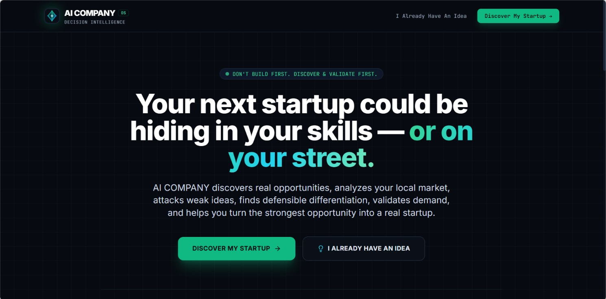
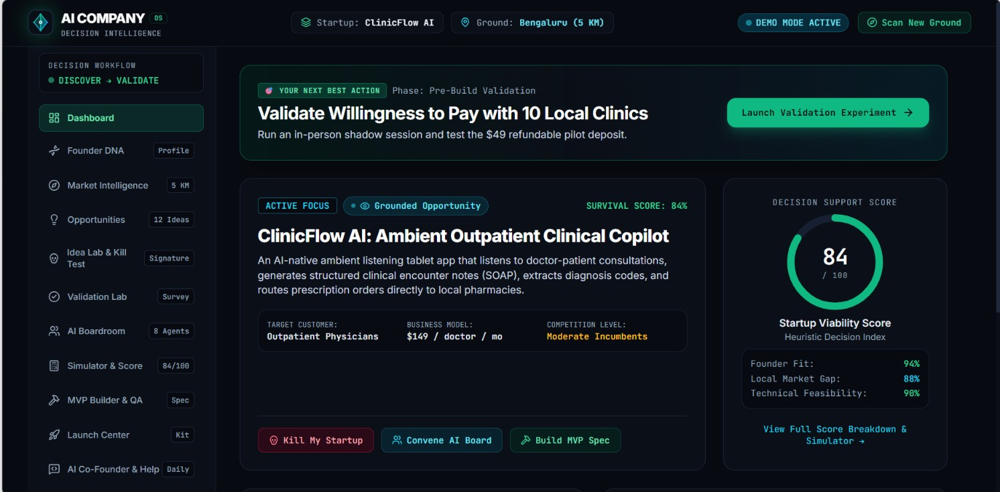
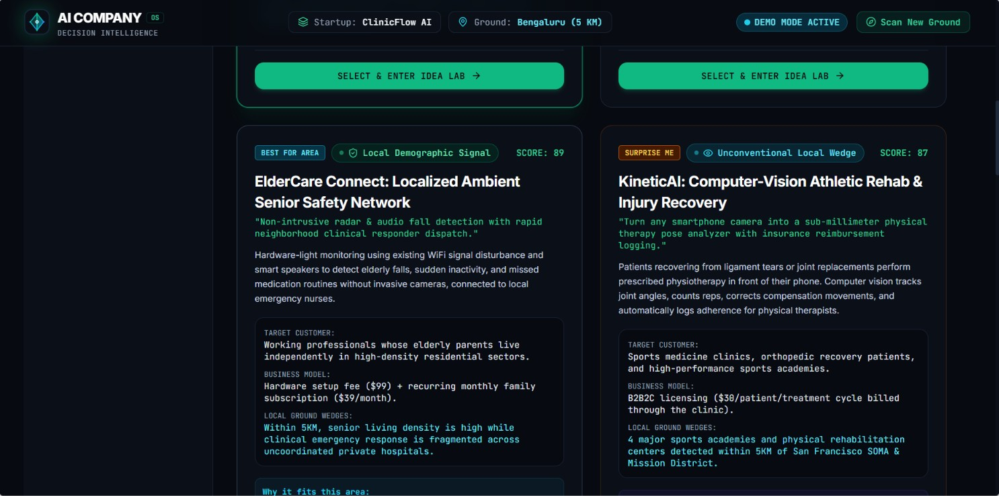
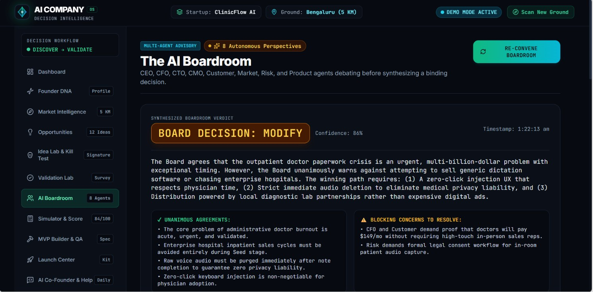
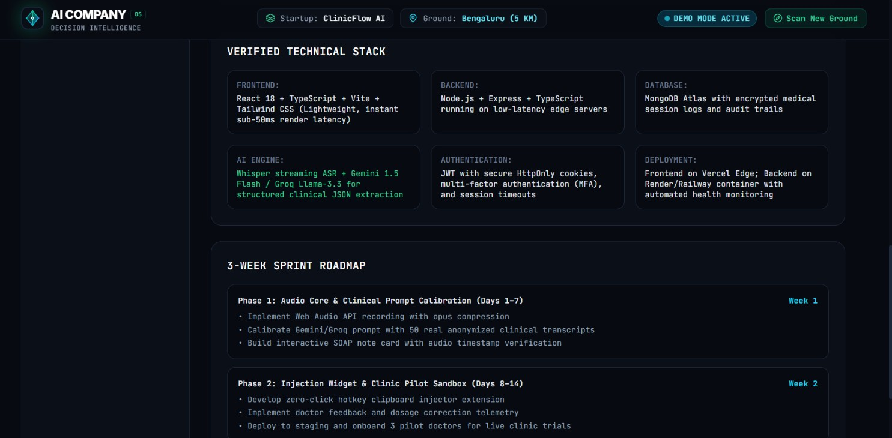

# AI COMPANY — AI-First Startup Decision Intelligence Platform

> **"Your AI co-founder for discovering, validating, and launching the right startup."**  
> *"Your next startup could be hiding in your skills — or on your street."*
> **DEMO VIDEO LINK:**-https://drive.google.com/file/d/1SKhdrb8WmPNzXtYWLG2NydIwv0OkqeBe/view?usp=sharing




---

## 1. Executive Summary & Core Philosophy

Most startup tools today simply generate random business ideas, write generic pitch decks, and flatter weak hypotheses. They encourage founders to **build first** before asking whether the business should exist at all.

**AI COMPANY** is a serious, investor-grade decision-intelligence platform built on a foundational philosophy:

```
DON'T BUILD FIRST.

DISCOVER  →  VALIDATE  →  DIFFERENTIATE  →  DECIDE  →  BUILD  →  LAUNCH
```

Rather than an ungrounded brainstorming chatbot, AI COMPANY combines:
$$\text{FOUNDER DNA} \times \text{LOCATION} \times \text{MARKET} \times \text{COMPETITION} \times \text{AI MULTI-AGENT REASONING}$$

to definitively answer the three essential startup questions:
1. **WHAT SHOULD I BUILD?** (Based on your unique capability profile, technical depth, and preferences)
2. **WHAT SHOULD BE BUILT HERE?** (Based on 5KM local business density, customer review complaints, and structural gaps)
3. **WHAT SHOULD I BUILD HERE?** (The Golden Intersection where your technical moat solves an acute local problem)

---

## 2. Signature UX Moments & Core Features

### 🧬 Moment 1: Founder DNA Profile
- **Not a psychological diagnosis** — a startup preference and capability profile.
- Multi-step interactive onboarding: 26+ domains (AI, Cybersecurity, Healthcare, FinTech, Robotics, etc.) with priority drag-weighting.
- Interactive operational sliders: AI Intensity, Technical Complexity, Risk Appetite, Investment, Scalability, MVP Speed, B2C vs B2B.
- Real-time 9-dimension capability radar chart (Recharts) and AI executive summary.



### 📍 Moment 2: 5KM Market Intelligence & Interactive Competitor Radar
- Grounded location scanner with 1KM, 5KM, 15KM, 50KM radius selector.
- Animated multi-step radar sweep (geolocation, density clustering, review signal extraction, gap detection).
- Interactive Dark Matter Cartography map (Leaflet) with radius pulse, competitor pins (rose), and referral partner pins (emerald).
- **Competitor Detail Intelligence**: Incumbent strengths, potential weaknesses, customer pain signals, and one-click `[ HOW CAN I WIN? ]` strategic wedge generator.
- **"What's Missing Here?" Gap Finder**: Analyzes category competition levels (High / Medium / Low) with evidence confidence scores and validation requirements.
- **Complementary Business Partner Detector**: Identifies non-competing businesses (e.g. diagnostic labs and gyms for health startups) to build local referral flywheels.

### 💡 Moment 3: The Opportunity Radar (12 Discovered Ventures)
Categorized across 4 distinct discovery paradigms:
- **Best Intersection** (Founder × Market): The highest-conviction recommendations combining technical moat with local urgency.
- **Best For You** (Founder-First): Ranked purely on technical depth, risk tolerance, and operational preferences.
- **Best For This Area** (Market-First): Uncovers urgent local voids regardless of existing comfort zones.
- **✨ Surprise Me** (Unconventional): Deliberately recommends high-signal opportunities outside usual interests where unfair technical leverage exists.



### 💀 Moment 4: Signature "Kill My Startup" (Adversarial Devil's Advocate)
- The AI acts as a hardened seed investor and devil's advocate.
- Evaluates 10 vulnerability vectors: problem acuity, incumbent entrenchment, willingness to pay, switching friction, copycat vulnerability, and fatal failure points.
- **Transparent Heuristic Survival Score** (0–100) and risk tiering.
- "Why It May Fail" bulleted reality check and "How To Fix It" strategic interventions.
- **Honest Verdict**: The AI is strictly allowed to recommend `DON'T BUILD THIS`.

### ✨ Moment 5: Make It Unique (10 Differentiation Vectors)
- Generates unfair defensibility across: Product, AI, UX, Pricing, Distribution, Retention, Data Moat, Partnerships, Specialization, and Defensibility.
- Side-by-side comparison: **Original Raw Concept** vs. **✨ High-Defensibility Improved Concept**.

### ⚔️ Moment 6: Startup Battle
- Side-by-side strategic model comparison: Low-cost B2C vs Premium B2C vs B2B SaaS vs Marketplace Platform with feasibility, scalability, and risk analysis.

### 👥 Moment 7: The AI Boardroom (8 Autonomous C-Suite Agents)
- Live multi-agent debate featuring 8 distinct autonomous personas:
  - **CEO (Elena Vance)**: Speed to market, execution velocity, land-grab bias.
  - **CFO (Marcus Sterling)**: Unit economics, gross margins, CAC paybacks, burn rate.
  - **CTO (Dr. Aris Thorne)**: Architecture depth, model latency, zero-click keyboard injection.
  - **CMO (Samantha Chen)**: Distribution channel saturation, partner referral flywheels.
  - **CUSTOMER (Dr. Rajesh Patel)**: Clinical workflow friction, documentation anxiety.
  - **MARKET (Victoria Ramos)**: Outpatient TAM ($9.2B), macro tailwinds, fragmented clinics.
  - **RISK (David K. Lawson)**: Medical liability, patient consent, zero raw audio storage.
  - **PRODUCT (Liam O'Connor)**: Anti-scope creep, MVP simplicity, 2-step user journey.
- Live animated debate timeline, explicit clashes (e.g. CEO vs CFO on pricing, CTO vs Risk on privacy), and synthesized **Board Decision** (`BUILD`, `MODIFY`, `VALIDATE`, `DONT_BUILD`).



### 📊 Moment 8: Heuristic Startup Score & 12-Month Simulator
- 10-dimension heuristic scoring index with strongest/weakest factor analysis and biggest uncertainty.
- Interactive financial simulator: Modulate price, CAC, churn rate, and marketing budget to inspect 12-month projections across Conservative, Base, and Aggressive scenarios.

### 🧪 Moment 9: Validation Lab & "Ask The Market" Live Public Survey
- Structured assumption-killing experiments (shadow sessions, willingness-to-pay deposits).
- **Public Shareable Survey Link** (`/survey/survey-ai-co-default`) with standalone respondent UI.
- Real-time customer feedback analytics (Interested %, Would Pay %, Top Requested Features) cleanly separated from AI inferences.

### 🛠️ Moment 10: Scope-Guarded MVP Builder, AI Build & QA Agents
- Core features prioritized by P0 (Critical), P1 (Important), P2 (Nice to have).
- **"🚫 WHAT NOT TO BUILD YET" Manifesto**: Explicitly guards against overbuilding hospital enterprise billing suites or mobile apps before securing pilot clinics.
- AI Build Agent execution trace (Architecture, Database, Auth, APIs, UI, Testing, Deployment).
- "Break My App" QA stress-test report & Automated Security Readiness Auditor.



### 🚀 Moment 11: Launch Center & Persistent AI Co-Founder
- Complete go-to-market kit: Landing page copy, pricing tiers, social announcement threads (LinkedIn, X/Twitter), cold email campaign, 2-minute demo pitch script, and first 100 customer playbook.
- Persistent AI Co-Founder answering "What should I do today?" with automated mentor context brief escalation.

---

## 3. Trust, Transparency & Evidence System

To ensure complete credibility for founders and investors, AI COMPANY adheres to a strict 5-tier evidence tagging system across all cards, insights, and data points:

| Badge | Level | Meaning |
| :--- | :--- | :--- |
| 🟢 **VERIFIED** | Verified Data | Direct user inputs or verified real-world source |
| 🔵 **OBSERVED** | Observed Data | Grounded pattern observed in public business registries/reviews |
| 🟡 **ESTIMATED** | AI Inference | Heuristic decision inference generated by AI models |
| 🟠 **UNVALIDATED** | Requires Testing | Critical assumption needing customer field experiments |
| 🔴 **ASSUMPTION** | Hypothesis | Unproven founder hypothesis |

---

## 4. Technical Architecture & Stack

```
[ Frontend: React 18 + Vite + TypeScript + Tailwind CSS ]
      │
      ├── Recharts (Founder Radar & Progress Metrics)
      ├── Leaflet (Dark Matter Cartography & Competitor Markers)
      ├── Framer Motion & Lucide Icons
      └── React Router DOM v6
      │
      ▼ HTTP REST / Reverse Proxy
[ Backend: Node.js + Express + TypeScript (ESM) ]
      │
      ├── Multi-Agent Centralized AI Service
      │     ├── Groq API (Llama-3.3-70b-versatile)
      │     ├── Google Gemini (gemini-1.5-flash / gemini-2.0)
      │     ├── OpenAI (GPT-4o-mini)
      │     └── Grounded Deterministic Domain Agent Fallback Engine
      │
      ├── Data Storage & Persistence
      │     ├── MongoDB Atlas (Mongoose Schemas for Production)
      │     └── Zero-Config In-Memory Decision Store (Instant local run)
      │
      └── Public Survey REST Gateway
```

---

## 5. Installation & Local Development

### Prerequisites
- **Node.js**: v18+ (tested on Node v24.15)
- **npm**: v9+

### Quick Start (One Command)

1. Clone the repository:
```bash
git clone https://github.com/HackIndiaXYZ/ai-first-startup-hackathon-build-a-startup-using-ai-only-teamrookies.git
cd ai-first-startup-hackathon-build-a-startup-using-ai-only-teamrookies
```

2. Install all dependencies across root, server, and client:
```bash
npm run install:all
```

3. Start both backend and frontend concurrently:
```bash
npm run dev
```

The system will start:
- 🚀 **Backend Server**: [http://localhost:5000](http://localhost:5000)
- 💻 **Frontend Web App**: [http://localhost:5173](http://localhost:5173)

---

## 6. Environment Variables

Create a `.env` file in `/server` based on `.env.example`:

```env
PORT=5000
NODE_ENV=development
CLIENT_URL=http://localhost:5173

# Optional Database (Falls back automatically to high-performance in-memory store if omitted)
MONGODB_URI=mongodb://localhost:27017/ai-company

# Optional External LLM Keys (Groq / Gemini / OpenAI)
# If left blank, the platform runs seamlessly on its built-in Decision Intelligence Engine
GROQ_API_KEY=
GEMINI_API_KEY=
OPENAI_API_KEY=

# Set to true for hackathon presentation mode
DEMO_MODE=true
```

---

## 7. 3-Minute Hackathon Demo Script

1. **The Problem (0:00 - 0:30)**:
   - Open Landing Page: "Most tools ask 'What can AI build?'. AI COMPANY asks 'Should you build this at all?'"
   - Click `[ DISCOVER MY STARTUP ]`.
2. **Founder DNA & 5KM Ground (0:30 - 1:00)**:
   - Select skills (AI, Cybersecurity, Healthcare) & preference sliders.
   - Click `[ SCAN MARKET & GENERATE DNA ]`. Show the 9-dimension radar chart and 5KM ground mapping.
3. **The Opportunity Radar (1:00 - 1:30)**:
   - Explore the 12 opportunities: "Best Intersection", "Best For Area", and "✨ Surprise Me".
   - Select **ClinicFlow AI** (Ambient Outpatient Clinical Copilot).
4. **💀 Kill My Startup & Differentiation (1:30 - 2:00)**:
   - Run the Kill Test: Survival Score (68/100), fatal questions, and "Why It May Fail".
   - Switch to **✨ Make It Unique**: 10-vector defensibility transformation.
5. **The AI Boardroom Debate & MVP (2:00 - 3:00)**:
   - Open the AI Boardroom: Watch the 8 C-Suite agents clash and synthesize the `MODIFY` decision.
   - Show the MVP Builder and the critical **"What NOT To Build Yet"** scope guard.
   - Show the Live Public Survey link and instant respondent analytics.

---

## 8. License & Team Credits

Built for the **AI-First Startup Hackathon** by **TEAM ROOKIES** (**Saurav B**).  
Licensed under the [MIT License](LICENSE).
